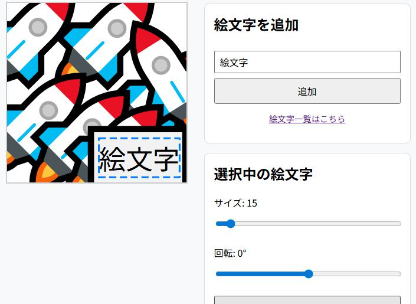

# 🎨 絵文字ファビコンエディター (Emoji Favicon Editor)

ブラウザ上で簡単に、複数の絵文字やテキストを組み合わせたオリジナルのSVGファビコンを作成できるエディターです。

[🎨 ここからすぐに使えます](https://yofumin.github.io/emoji-favicon-editor/)

## ✨ SVGファビコンの特徴

このツールで生成されるSVG形式のファビコンには、一般的に以下のような特徴があります。

*   **ライセンス管理の容易さ**: OS標準のフォントで表示される絵文字やテキストを利用するため、多くの画像素材のようにライセンスを個別に確認する手間がありません。
*   **軽量なデータ**: 画像ファイルをData URLに変換する場合と比較して、SVGは短いテキストデータで表現できるため、HTMLに埋め込む際の記述を簡潔にできます。
*   **高解像度**: ベクター形式であるため、どのようなサイズの画面でもクリアに表示されやすい特徴があります。

## 🚀 特徴 (Features)

*   **単一HTMLファイル**: すべての機能が1つのHTMLファイルにまとまっており、ダウンロードしてすぐに使えます。
*   **絵文字もテキストもOK**: 絵文字だけでなく、お好きな文字や記号もファビコンの要素として追加できます。
*   **直感的な操作**: 要素を追加し、ドラッグ＆ドロップで自由に配置できます。
*   **詳細な調整**: 選択した要素のサイズ（拡大・縮小）や回転が可能です。
*   **多様な出力**: 以下の形式でデータを生成・保存できます。
    *   HTML用 `<link>` タグ
    *   ユーザースクリプト用 `@icon` データ
    *   SVGソースコード
    *   PNG画像 (256x256)
*   **ロード機能**: 生成したSVGソースコードを読み込み、編集を再開できます。

## 🖥️ 使い方 (Usage)

1.  入力欄にお好みの絵文字や文字を入力し、「追加」ボタンを押します。
2.  キャンバス（エディター領域）に表示された要素をクリックで選択し、ドラッグして好きな位置に移動します。
3.  要素を選択した状態で、コントロールパネルの各種スライダーを操作し、「サイズ」と「回転」を調整します。
4.  デザインが完成したら、「生成」セクションから必要な形式のボタンをクリックして、コードや画像を生成・取得します。

## ⚠️ ご注意

*   **表示の差異について**: 絵文字は、閲覧するユーザーのOS（Windows, macOS, Androidなど）やブラウザによって、デザインが異なる場合があります。
*   **ロード機能について**: ロード機能は「SVGソース」形式の読み込みにのみ対応しています。「HTMLリンク用」の文字列を読み込むことはできません。

## 📜 ライセンス (License)

このプロジェクトは [MITライセンス](LICENSE) のもとで公開されています。
